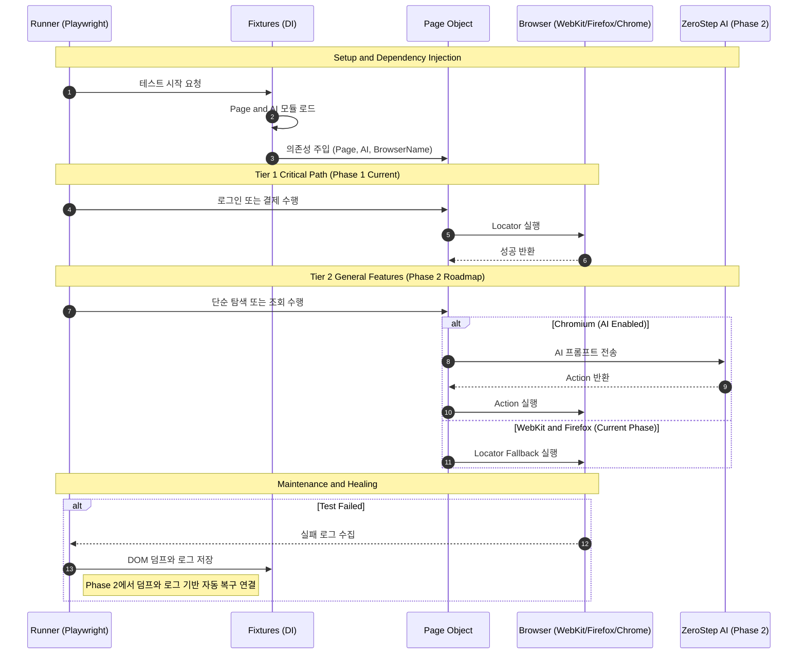

# 프로젝트 지침서

## 프로젝트별 환경 (다른 프로젝트와 격리)

이 프로젝트만의 환경을 쓰고, 다른 Playwright 프로젝트에 영향을 주지 않도록 아래를 지킨다.

| 항목 | 이 프로젝트 | 다른 프로젝트에 영향 없이 하기 |
|------|-------------|-------------------------------|
| **브라우저 설치 경로** | `PLAYWRIGHT_BROWSERS_PATH=.playwright-browsers` 를 **package.json 스크립트에서만** 사용한다. | 셸이나 전역 `.env`에 `PLAYWRIGHT_BROWSERS_PATH`를 **설정하지 않는다.** 설정하면 다른 프로젝트가 같은 경로를 참조할 수 있다. |
| **실제 경로** | `npm run` 실행 시 작업 디렉터리는 이 프로젝트 루트이므로 `.playwright-browsers`는 이 프로젝트 안에만 생성·사용된다. | 다른 프로젝트는 각자 루트에서 실행하면 각자 브라우저 캐시를 사용한다. |
| **.env** | 이 프로젝트 루트의 `.env`만 사용한다 (`dotenv.config()`가 `process.cwd()` 기준으로 로드). | 다른 프로젝트 디렉터리에서 실행하면 그 프로젝트의 `.env`가 로드되므로 서로 침범하지 않는다. |

- 브라우저 설치: 이 프로젝트에서만 `npm run pw:install` 실행. 설치되는 브라우저는 이 프로젝트의 `.playwright-browsers/` 안에만 둔다.
- 여러 Playwright 프로젝트를 같은 머신에서 쓸 때: 셸 프로필(`~/.zshrc` 등)에 `export PLAYWRIGHT_BROWSERS_PATH=...` 를 두지 말고, 각 프로젝트의 npm 스크립트에서만 경로를 지정한다.

**Apple Silicon (M1/M2 등):** 테스트는 `channel: 'chrome'`으로 **시스템에 설치된 Google Chrome**을 사용한다. `.playwright-browsers`에 Chromium이 없어도 된다. Google Chrome이 없다면 설치하거나, 터미널에서 `npm run pw:install`을 실행해 이 프로젝트용 Chromium을 설치한다(네이티브 arm64 터미널에서 실행해야 arm64 빌드가 설치됨).

## 구조 개요

```
Playwright Agent Test Automation
├── .env                       # 계정/토큰 (ZEROSTEP_TOKEN 등). 프로젝트 전용.
├── .env.example               # .env 예시 및 환경 변수 설명 (PLAYWRIGHT_BROWSERS_PATH는 스크립트 전용)
├── playwright.config.ts       # 설정 (Chromium 기준, ZeroStep AI 폴백)
├── package.json
│
├── features/                  # [Spec] BDD 시나리오 (Gherkin)
│
├── scripts/                   # [DevOps] 개발 생산성 도구
│   └── dump-dom.ts            # 수동 DOM 추출기
│
├── dom_dumps/                 # [Data] 실패 시 자동 저장되는 DOM 덤프
├── dom_logs/                  # [Data] 실패 시 자동 저장되는 로그(JSON)
│
├── steps/                     # [Glue Code]
│   ├── fixtures.ts            # 의존성 주입 + 실패 시 덤프/로그 자동 수집
│   └── login.steps.ts         # 시나리오-코드 매핑
│
└── pages/                     # [POM] Page Object Model
    ├── BasePage.ts            # 공통 로직 (Phase 2에서 AI Wrapper 확장 예정)
    └── LoginPage.ts           # 화면별 로직
```

## 실행 규칙

- `features/*.feature` 수정 시 `bddgen` 재생성이 필요하다.
- `steps/*.ts` 수정 시 UI 재실행만으로 반영된다.
- 항상 최신 반영을 보장하려면 `npm run test:ui:regen`을 사용한다.

## BDD UI 실행

- `npm run test:ui:regen`: BDD 재생성 후 UI 실행
- `npm run test:ui`: UI만 실행

## DOM 덤프 수집

- 실패 시 자동으로 `dom_dumps/`와 `dom_logs/`에 저장된다.
- `scripts/dump-dom.ts`는 수동 실행 도구이며 자동 파이프라인에 연결되어 있지 않다.

## 시퀀스 다이어그램


