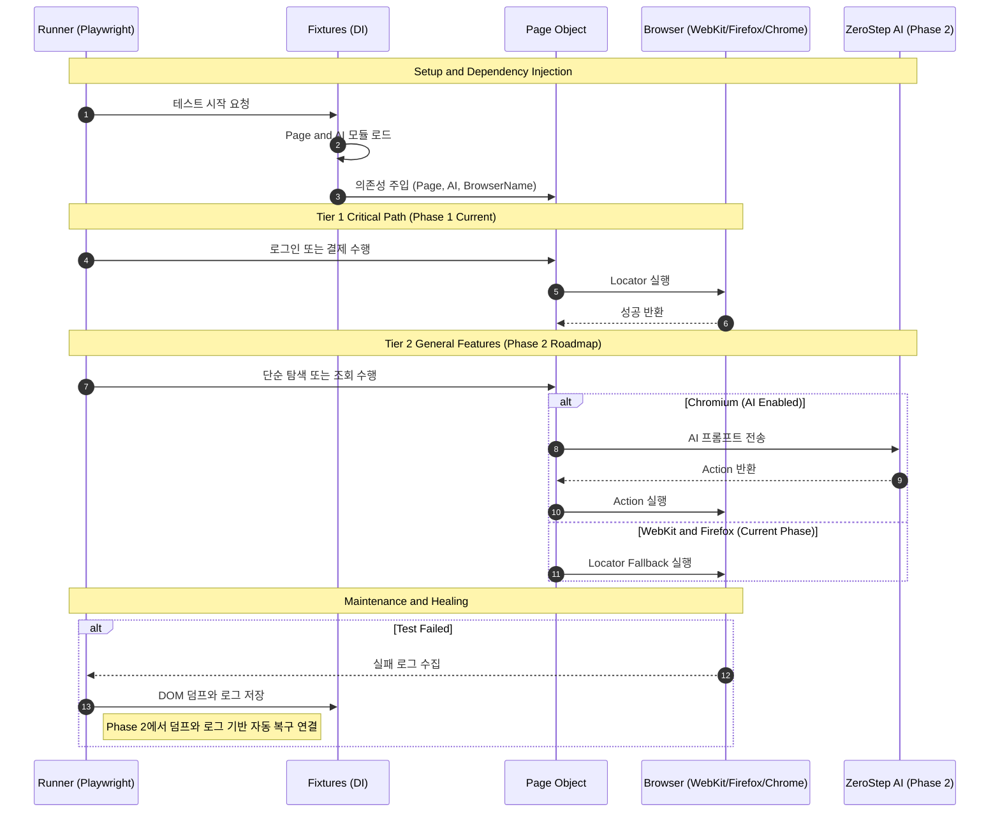

# 프로젝트 지침서

## 구조 개요

```
Playwright Agent Test Automation
├── .env                       # 계정/토큰 정보 (ZeroStep 준비 완료)
├── playwright.config.ts       # 설정 (WebKit/Firefox 호환성 중심 설정)
├── package.json
│
├── features/                  # [Spec] BDD 시나리오 (Gherkin)
│
├── scripts/                   # [DevOps] 개발 생산성 도구
│   └── dump-dom.ts            # 수동 DOM 추출기
│
├── dom_dumps/                 # [Data] 실패 시 자동 저장되는 DOM 덤프
├── dom_logs/                  # [Data] 실패 시 자동 저장되는 로그(JSON)
│
├── steps/                     # [Glue Code]
│   ├── fixtures.ts            # 의존성 주입 + 실패 시 덤프/로그 자동 수집
│   └── login.steps.ts         # 시나리오-코드 매핑
│
└── pages/                     # [POM] Page Object Model
    ├── BasePage.ts            # 공통 로직 (Phase 2에서 AI Wrapper 확장 예정)
    └── LoginPage.ts           # 화면별 로직
```

## 신규 설치 시 지침

토큰·리소스 낭비를 줄이기 위해, 신규 설치가 필요할 때는 아래를 따른다.

1. **프로젝트 간에 영향을 받지 않도록 환경을 구성한다.**  
   (예: 이 프로젝트는 `PLAYWRIGHT_BROWSERS_PATH=.playwright-browsers` 로 브라우저를 프로젝트 내부에만 두고, 다른 프로젝트와 공유하지 않는다.)

2. **신규 프로그램 설치 시, 1번의 영향 범위를 확인하고, 정말 설치가 필요한 경우에만 진행한다.**  
   이미 프로젝트 전용으로 설치된 경로가 있으면 재설치나 전역 설치를 제안하지 않는다.

## 실행 규칙

- `features/*.feature` 수정 시 `bddgen` 재생성이 필요하다.
- `steps/*.ts` 수정 시 UI 재실행만으로 반영된다.
- 항상 최신 반영을 보장하려면 `npm run test:ui:regen`을 사용한다.

## BDD Gen: Feature 기준 실행 (유지보수 프로세스)

- **원칙:** UI·기능이 바뀌면 담당자는 **Feature(BDD 시나리오)만 수정**한다. 스펙(.feature.spec.js)은 수동 수정하지 않는다.
- **스펙 생성:** Feature 수정 후 반드시 **`npm run bddgen`**으로 스펙을 재생성한다. 이 스크립트는 `playwright.config.ts`·`features/`가 있는 프로젝트 루트를 기준으로 bddgen을 실행하므로, 수정한 feature 내용이 그대로 스펙에 반영된다.
- **주의:** `npx playwright-bdd`를 **직접 실행하지 말 것**. 터미널 cwd에 따라 다른 feature 파일을 참조할 수 있으므로, 항상 **`npm run bddgen`**만 사용한다. (자동화·CI에서도 동일)

## BDD UI 실행

- `npm run test:ui:regen`: BDD 재생성 후 UI 실행
- `npm run test:ui`: UI만 실행

## DOM 덤프 수집

- **언제 사용되나**: 테스트가 **실패할 때마다** 픽스처 `dumpOnFailure`가 자동 실행된다.
- `dom_dumps/`: 실패 시점의 페이지 HTML(script/style 제거)이 `{시나리오명}-{타임스탬프}.html`로 저장된다.
- `dom_logs/`: 동일 시점의 제목·파일·상태·url·에러 메시지·스택이 `{시나리오명}-{타임스탬프}.json`로 저장된다.
- **용도**: 실패 원인 분석 시, 어떤 페이지에서·어떤 에러로 깨졌는지 사람이 열어서 확인하기 위함이다. 다른 코드에서 자동으로 읽어 쓰지는 않는다.
- `scripts/dump-dom.ts`는 수동 실행용이며, 위 자동 덤프와는 별개다.

## 셀프힐링(selfHealLocator)

- **왜 넣었나**: DOM/클래스명이 바뀌어도 "다음 화살표" 같은 요소를 여러 후보 셀렉터·역할·텍스트로 찾고, **성공한 셀렉터를 `self_heal/selector-map.json`에 저장**해 다음 실행부터 우선 사용한다. 선택자 변경에 덜 깨지게 하려는 목적이다.
- **어디서 쓰나**: KPA-048의 "배너 영역 다음 화살표 버튼" 찾기(`getNextArrowButton`)에서만 사용 중이다.

## 수정 시 절차

- 테스트 실패 시 **덤프 로그(`dom_logs/`, `dom_dumps/`)와 셀프힐(`self_heal/selector-map.json`)을 확인**한 뒤, 원인에 맞게 수정한다.
- 수정 후 테스트를 다시 실행하고, **통과할 때까지** 위 과정을 반복한다.

## 시퀀스 다이어그램


