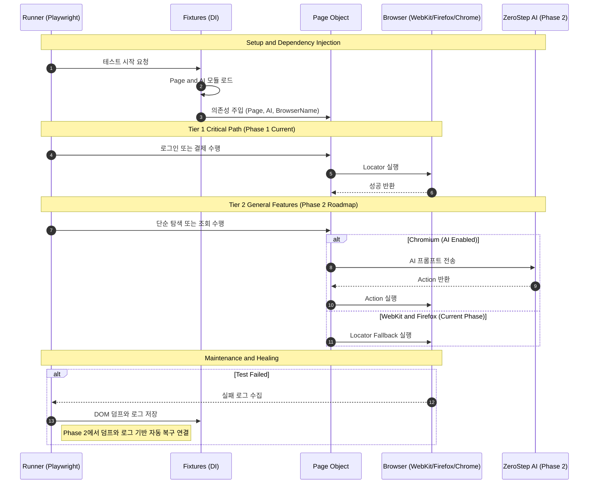

# 프로젝트 지침서

## 프로젝트별 환경 (다른 프로젝트와 격리)

이 프로젝트만의 환경을 쓰고, 다른 Playwright 프로젝트에 영향을 주지 않도록 아래를 지킨다.

| 항목 | 이 프로젝트 | 다른 프로젝트에 영향 없이 하기 |
|------|-------------|-------------------------------|
| **브라우저 설치 경로** | `PLAYWRIGHT_BROWSERS_PATH=.playwright-browsers` 를 **package.json 스크립트에서만** 사용한다. | 셸이나 전역 `.env`에 `PLAYWRIGHT_BROWSERS_PATH`를 **설정하지 않는다.** 설정하면 다른 프로젝트가 같은 경로를 참조할 수 있다. |
| **실제 경로** | `npm run` 실행 시 작업 디렉터리는 이 프로젝트 루트이므로 `.playwright-browsers`는 이 프로젝트 안에만 생성·사용된다. | 다른 프로젝트는 각자 루트에서 실행하면 각자 브라우저 캐시를 사용한다. |
| **.env** | 이 프로젝트 루트의 `.env`만 사용한다 (`dotenv.config()`가 `process.cwd()` 기준으로 로드). | 다른 프로젝트 디렉터리에서 실행하면 그 프로젝트의 `.env`가 로드되므로 서로 침범하지 않는다. |

- 브라우저 설치: 이 프로젝트에서만 `npm run pw:install` 실행. 설치되는 브라우저는 이 프로젝트의 `.playwright-browsers/` 안에만 둔다.
- 여러 Playwright 프로젝트를 같은 머신에서 쓸 때: 셸 프로필(`~/.zshrc` 등)에 `export PLAYWRIGHT_BROWSERS_PATH=...` 를 두지 말고, 각 프로젝트의 npm 스크립트에서만 경로를 지정한다.

**Apple Silicon (M1/M2 등):** 테스트는 `channel: 'chrome'`으로 **시스템에 설치된 Google Chrome**을 사용한다. `.playwright-browsers`에 Chromium이 없어도 된다. Google Chrome이 없다면 설치하거나, 터미널에서 `npm run pw:install`을 실행해 이 프로젝트용 Chromium을 설치한다(네이티브 arm64 터미널에서 실행해야 arm64 빌드가 설치됨).

## 구조 개요

```
playwright-agent-test-automation/
├── .env                           # 계정/토큰 (ZEROSTEP_TOKEN 등). git 제외.
├── .env.example                   # .env 예시 및 환경 변수 설명
├── .gitignore
├── playwright.config.ts           # BDD·프로젝트(chromium / chromium-remaining) 설정
├── package.json
├── tsconfig.json
├── README.md
├── PROJECT_OVERVIEW.md             # 본 지침서
│
├── .features-gen/                 # [Generated] playwright-bdd가 생성한 스펙 (*.feature.spec.js). git 제외 가능
│   └── ...                        # features/*.feature와 1:1 대응
│
├── .github/
│   └── workflows/
│       └── playwright.yml         # CI 파이프라인
│
├── docs/                          # [Doc] 설계·분석·가이드
│   ├── agent-prompts/             # 에이전트용 프롬프트 (design, requirements, test)
│   ├── SCENARIO_CLASSIFICATION.md # 순수 vs 스텁 시나리오 구분
│   ├── STUB_SCENARIOS_AUDIT.md    # 스텁 시나리오 전수 조사
│   ├── STABILITY_GUIDE.md         # 실패 대응·셀렉터 권장
│   ├── FRAMEWORK_OVERVIEW.md
│   └── ...                        # 기타 가이드
│
├── features/                      # [Spec] BDD 시나리오 (Gherkin)
│   ├── 00-login.feature           # 로그인 (쿠키 저장용, 선행 실행)
│   ├── kpa-002.feature
│   ├── kpa-003.feature
│   ├── ...                        # kpa-XXX.feature (약 120여 개)
│   └── adult/                     # 성인 전용 (별도 처리)
│       └── README.md
│
├── pages/                         # [POM] Page Object (일부 시나리오/ZeroStep 연동)
│   ├── BasePage.ts                # 공통 로직·AI 연동
│   └── LoginPage.ts               # 로그인 화면
│
├── scripts/                       # [DevOps] 유틸·자동화
│   ├── dump-dom.ts                # 수동 DOM 추출
│   ├── last-failure.ts            # 마지막 실패 한 건 조회
│   ├── notify-slack.ts            # CI 실패 시 Slack 알림
│   ├── overnight-generate-remaining.mjs  # 스텁 시나리오 스텝 생성
│   └── clean-old-dumps.mjs       # 덤프 정리
│
├── steps/                         # [Glue] BDD 스텝 정의 (feature 문장 ↔ 코드)
│   ├── fixtures.ts                # 의존성 주입, 실패 시 덤프/로그 수집
│   ├── common.navigation.steps.ts # 공통: 접속·GNB 등
│   ├── common.auth.steps.ts       # 공통: 로그인 상태
│   ├── common.episode.steps.ts    # 공통: 회차·뷰어 진입
│   ├── login.steps.ts             # 00-login 전용
│   ├── kpa-002.steps.ts
│   ├── kpa-003.steps.ts
│   ├── ...                        # kpa-XXX.steps.ts (feature와 1:1 대응)
│   └── kpa-008-zerostep.steps.ts  # ZeroStep AI 연동 예시
│
├── dom_dumps/                     # [Data] 실패 시 자동 저장 DOM 덤프. git 제외.
├── dom_logs/                      # [Data] 실패 시 자동 저장 로그(JSON). git 제외.
├── test-results/                  # [Data] Playwright 실행 결과·트레이스. git 제외.
└── .auth/                         # [Data] 로그인 쿠키 (storageState-*.json). git 제외.
```

## 실행 규칙

- `features/*.feature` 수정 시 `bddgen` 재생성이 필요하다.
- `steps/*.ts` 수정 시 UI 재실행만으로 반영된다.
- 항상 최신 반영을 보장하려면 `npm run test:ui:regen`을 사용한다.

## BDD UI 실행

- `npm run test:ui`: 순수 시나리오만 UI 실행 (스텁 제외)
- `npm run test:ui:demo`: 시연용, 순수 시나리오만 UI 실행
- `npm run test:ui:stub`: **스텁 시나리오만** UI 실행 (점검·구현 전환용). 목록: `docs/STUB_SCENARIOS_LIST.md`

## 로그인 쿠키 저장/로드 (미인증·성인 인증 분리)

- **저장:** `login.feature` 실행 시 시나리오별로 쿠키가 분리 저장된다.
  - "미인증 계정으로 로그인 성공" → `.auth/storageState-nonAdult.json`
  - "성인 인증 계정으로 로그인 성공" → `.auth/storageState-adult.json`
- **로드:** 로그인이 필요한 시나리오( skipAuth 목록에 없는 feature)는 실행 시 저장된 쿠키를 사용한다.
  - 프로젝트 **chromium** → 미인증 쿠키(`storageState-nonAdult.json`) 사용
  - 프로젝트 **chromium-adult** → 성인 인증 쿠키(`storageState-adult.json`) 사용
- **사전 조건:** 로그인 필요 시나리오를 돌리기 전에 `login.feature`에서 해당 계정 시나리오를 한 번 실행해 두어야 한다. (`.auth/`는 `.gitignore`에 포함되어 커밋되지 않는다.)

## DOM 덤프 수집

- 실패 시 자동으로 `dom_dumps/`와 `dom_logs/`에 저장된다.
- `scripts/dump-dom.ts`는 수동 실행 도구이며 자동 파이프라인에 연결되어 있지 않다.
- 마지막 실패 한 건만 빠르게 보려면: `npm run last-failure` (덤프를 브라우저로 열려면 `npm run last-failure -- --open`).
- 실패 대응 절차·신규 시나리오 추가·셀렉터 권장 사항: `docs/STABILITY_GUIDE.md` 참고.

## 덤프/덤프 로그 정리 배치

- **수동 실행**: `npm run clean:dumps` (기본: 1일 초과된 파일 삭제), `npm run clean:dumps -- 3` (3일 초과분만 삭제).
- **스크립트 위치**: `scripts/clean-old-dumps.mjs`. 프로젝트 루트를 **스크립트 경로 기준**으로 찾으므로, cron에서 작업 디렉터리 없이 실행해도 동작한다.
- **cron 등록 예시** (매일 새벽 2시, 1일 지난 덤프만 삭제):  
  `0 2 * * * /usr/bin/node /Volumes/Project/playwright-agent-test-automation/scripts/clean-old-dumps.mjs 1`  
  (경로는 본인 프로젝트 루트로 바꿀 것. `which node`로 node 경로 확인)
- **동작하지 않을 때**: 예전에는 `process.cwd()`로 프로젝트 루트를 잡아서, cron이 홈 디렉터리 등에서 실행되면 `dom_dumps`/`dom_logs`를 찾지 못했다. 지금은 스크립트 디렉터리 기준으로 루트를 계산하므로, **스크립트를 절대 경로로 실행**하면 cwd와 관계없이 동작한다.

## 시퀀스 다이어그램


