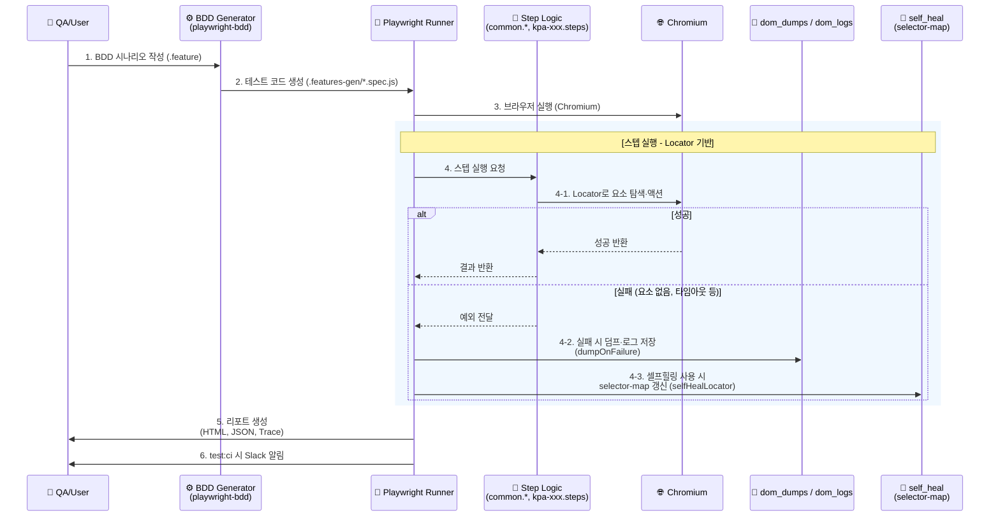

# KakaoPage Playwright & AI 기반 BDD 테스트 자동화 프레임워크 구축

현재 구현 기준 정리 문서. (기존 PDF 설계 대비 변경·추가 반영)

---

## 1. 목적 및 기대 효과

### 1.1 목적

- 협업 중심 테스트: 기획서 기반 BDD(Gherkin)로 기획·개발·QA 공통 언어 확보.
- 운영 안정성: 핵심 경로는 Locator 중심으로 재현성·신뢰도 보장.
- 확장 가능 아키텍처: AI(ZeroStep) 전환 시 의존성 주입(DI) 구조로 수정 최소화.

### 1.2 기대 효과

- **가시성**: 자연어(Scenario) 기반 리포팅.
- **안정성 확보**: 핵심 로직은 코드 기반(Locator)으로 제어하여 실행 속도와 재현성을 보장하고, 실패 시 덤프(dom_dumps)·로그(dom_logs) 수집과 셀프힐링(selector-map)으로 원인 분석 및 복구를 지원하는 구조.
- **유지보수성 강화**: 공통 스텝(common.navigation, common.auth, common.episode), 로그인(login.steps), 기능별 스텝(kpa-xxx.steps)으로 모듈화하여 테스트 코드 재사용성과 수정 범위 최소화.
- **확장성**: fixtures에서 Page·의존성 주입 구조로 향후 AI 트랙 도입 시 수정 범위 최소화.

---

## 2. 단계별 실행 계획 (현행)

| 단계 | 항목 | 상세 | 상태 |
|------|------|------|------|
| Phase 1 | 기반 | Playwright + playwright-bdd | 완료 |
| | 시나리오 | KPA-002~139 등 .feature | 완료 |
| | 구현 | Locator + common.* + kpa-xxx.steps | 완료 |
| | 데이터 | DOM Dump, dom_logs, self_heal | 완료 |
| | 스크립트 | dump-dom, overnight, last-failure, notify-slack, clean-old-dumps | 완료 |
| Phase 2 | AI | Chromium + ZeroStep (withAiFallback) | 부분 적용 |
| | Healing | selfHealLocator, Trace 활용 | 기초 구현 |
| | CI/CD | GitHub Actions, Slack (test:ci) | 적용 |

---

## 3. 프로젝트 구조 (현재)

### 3.1 디렉터리 트리

```
Playwright Agent Test Automation/
├── .env                    # 환경 변수 (ZEROSTEP_TOKEN, BASE_URL, 슬랙 웹훅 등). .env.example 참고
├── .env.example            # 환경 변수 템플릿
├── .auth/                   # 로그인 상태 저장 (storageState-nonAdult.json 등)
├── .github/
│   └── workflows/
│       └── playwright.yml  # CI (GitHub Actions)
│
├── playwright.config.ts    # Playwright 설정. defineBddConfig, Chromium 단일 프로젝트
├── package.json            # 스크립트: test, test:ui, bddgen, test:ci, overnight 등
├── tsconfig.json
│
├── features/               # [Spec] BDD 시나리오 (Gherkin)
│   ├── login.feature
│   ├── kpa-002.feature ~ kpa-139.feature
│   └── adult/              # 성인 전용 시나리오 (testIgnore로 제외 가능)
│
├── .features-gen/          # [Generated] playwright-bdd가 생성한 실행 스펙
│   └── features/
│       └── *.feature.spec.js
│
├── steps/                  # [Glue] 시나리오–코드 매핑 (Given/When/Then/And)
│   ├── fixtures.ts         # DI, BDD 훅, 덤프/로그(dumpOnFailure), 셀프힐링(selfHealLocator)
│   ├── common.navigation.steps.ts   # 공통: 접속, GNB 등
│   ├── common.auth.steps.ts        # 공통: 인증
│   ├── common.episode.steps.ts     # 공통: 회차/정렬
│   ├── login.steps.ts              # 로그인 시나리오
│   └── kpa-002.steps.ts ~ kpa-139.steps.ts   # 기능별 스텝 (KPA 시나리오)
│
├── pages/                  # [POM] Page Object Model
│   ├── BasePage.ts         # 공통: safeAi, smartClick, isAiEnabled
│   └── LoginPage.ts        # 로그인 화면
│
├── scripts/                # [DevOps] 개발·운영 도구
│   ├── dump-dom.ts         # 수동 DOM 추출
│   ├── overnight-generate-remaining.mjs   # 미구현 시나리오용 스텝 생성
│   ├── last-failure.ts     # 마지막 실패 테스트 재실행
│   ├── notify-slack.ts     # CI 결과 Slack 웹훅 전송
│   └── clean-old-dumps.mjs # 구 덤프 파일 정리
│
├── dom_dumps/              # [Data] 실패 시 자동 저장되는 DOM HTML
├── dom_logs/               # [Data] 실패 시 자동 저장되는 로그 JSON
├── self_heal/              # [Data] 셀프힐링 선택자 맵 (selector-map.json)
├── test-results/           # Trace, 스크린샷, results.json, error-context
│
└── docs/                   # 가이드·분석 문서
    ├── FRAMEWORK_OVERVIEW.md
    ├── agent-prompts/      # 에이전트용 프롬프트
    └── (기타 가이드)
```

### 3.2 역할 요약

| 구분 | 경로 | 역할 |
|------|------|------|
| Spec | features/ | BDD 시나리오(.feature). 기획·QA 공통 언어 |
| Generated | .features-gen/ | playwright-bdd가 생성한 실행 스펙. 직접 수정하지 않음 |
| Glue | steps/ | fixtures(공통 훅·DI) + common.*(공통 스텝) + login + kpa-xxx(기능별 스텝) |
| POM | pages/ | 화면별 로직. LoginPage 등 |
| Data | dom_dumps, dom_logs, self_heal | 실패 시 수집·복구용 자산 |
| DevOps | scripts/ | DOM 추출, overnight, 재실행, Slack, 덤프 정리 |

---

## 4. 처리 플로우

**구현**: Design(.feature) → defineBddConfig 등록 → bddgen으로 Spec 생성 → Step 구현(steps/*).

**실행**: testDir(.features-gen) 로드 → fixtures에서 page/LoginPage 주입 → Chromium workers:1 순차 실행 → Locator 기반 스텝 실행 → 실패 시 덤프·로그 수집 및 셀프힐링 맵 활용 → HTML/JSON 리포트, test:ci 시 Slack 알림.

### 4.1 시퀀스 다이어그램 (현재 구조)



---

## 5. 기술적 의사결정

- **Smart Hybrid**: Tier1 Locator 중심, Tier2 Locator+AI fallback. Chromium 단일 프로젝트.
- **데이터**: DOM Dump/dom_logs 자동 수집, self_heal 맵, Trace on-first-retry.
- **유지보수**: selfHealLocator, Trace·DOM 기반 Phase 2 Auto-healing 예정.

---

## 6. 현황

- BDD 시나리오 테스트 수행. test, test:ui, test:ci.
- HTML 리포트, 스크린샷, Trace, dom_dumps/dom_logs. CI 시 Slack 알림.
- KPA 시나리오 다수 확보. 일부 Multiple definitions 등 스텝 정리 진행 중.

---

## 7. 향후 로드맵

1. Smart Hybrid 고도화, AI 비용·속도 제어.
2. Trace·DOM 기반 Auto-healing 파이프라인.
3. 스텝 중복 제거, 성인(adult) 프로젝트 전략 정리.
4. 필요 시 WebKit/Firefox 프로젝트 재추가.

---

## Update History

| 일시 | 내용 |
|------|------|
| 26.02.01 | 초안 작성 |
| 26.02.04 | 현행 구현 반영 |
| (현재) | 문서 설계와 구현 차이 반영, 현행 구조·플로우·로드맵 재정리 |
